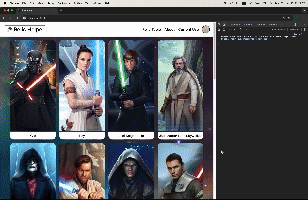
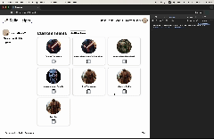

# Relic Helper Frontend

## Overview

Relic Helper Frontend is a web application designed to enhance the user experience for managing and relic materials and signal data required to upgrade characterrs in the game SWGoH. This project provides a modern and interactive interface for users to interact with the backend services of the Relic Helper platform.

## Current Features

- **Legendary Characters Requirements**: Check for required units information and relic materials required to upgrade.
- **Custom Teams Management**: Add and delete custom teams information.
- **Search and Filter**: Search for characters that you want to upgrade.
- **Interactive UI**: Smooth and responsive user interface with animations and transitions.
- **Real-time Updates**: Live updates on artifact status and details.
- **User Authentication**: Secure login and registration system.
- **Update User Profile**: Update User information

## Installation

To get started with the Relic Helper Frontend, follow these steps:

1. **Clone the repository**:

   ```bash
   git clone <repository-url>
   cd relic-helper-frontend
   ```

2. **Install dependencies**:

   ```bash
   npm install
   ```

3. **Start the development server**:

   ```bash
   npm start
   ```

4. **Build for production**:
   ```bash
   npm run build
   ```

In order for the frontend part of the project to work, the backend part also must be installed and run. Check backend repo branch: https://github.com/PQuaresma-94/relic-helper-backend/tree/stage-back-end

## Usage

Once the development server is running, you can access the application in your browser at `http://localhost:3000`. Use the application to manage custom teams and explore required units for legendary characters.

## Demo

Below are some GIFs demonstrating the key functionalities of the application:

- **Routes Navigation**
  

- **Screen Size Views**
  

- **Custom Team Feature**
  
